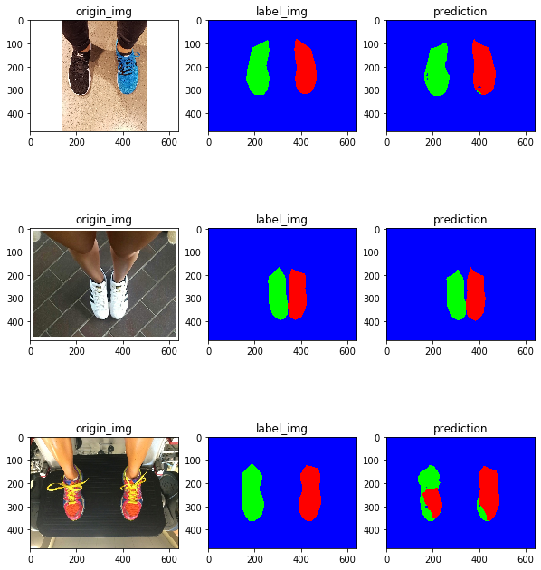

# pytorch-shoes-segmentation
[update 06/05/2020]

This repo is developed for shoes segmentation using FCN model. We will try Resnet-18, Resnet-34 or other small architecture as our network backbone, so that it can be easily run by embedded board.

## Requirements
- Python 3.5 or 3.6
- `gdown`, see [here](https://pypi.org/project/gdown/)
- `pytorch` 1.1.0 or newer
- `sklearn`
- `segmentation_models_pytorch`, see [here](https://github.com/qubvel/segmentation_models.pytorch)

We will keep updating this side project from time to time, hope you can find something useful.

## Steps from data collecting to FCN model building
1. Collect image data from google.
2. Use `utils/adjust_image.py` to keep consistency of image dimentions, here we limit size to 640x480 by resizing, cropping or padding approaches. 
3. Label the image by annotation tools and download the your collections, here we use [LabelMe](http://labelme.csail.mit.edu/Release3.0/).
4. Parse the collections (\*.xml files) to masks (\*.png files) by `parse_labelme_collection_to_mask.ipynb`. This script will create another folder to store labels(\*.xml), masks(\*.png), raw images(\*.png or jpg) and dataset list(\*.csv).  
Note that the color map of masks would be indexed from 0 to maximum 255 according classes number of your dataset. 
5. Construct your `torch.utils.data.Dataset`, and start training your FCN model. Check out `unet_test.ipynb` if you are interested.

## Progress

So far, we only labeled 100 images from the Internet, and trained Unet model(backbone: Resnet-18) with 200 epochs.  

Note that we used `segmentation_models_pytorch` package to build Unet model quickly. Here are the quick test results.

    

